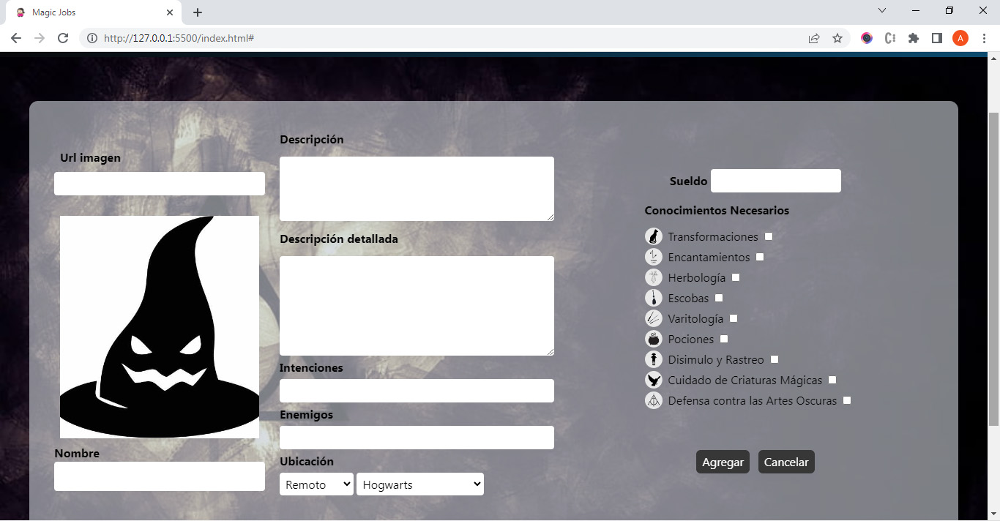
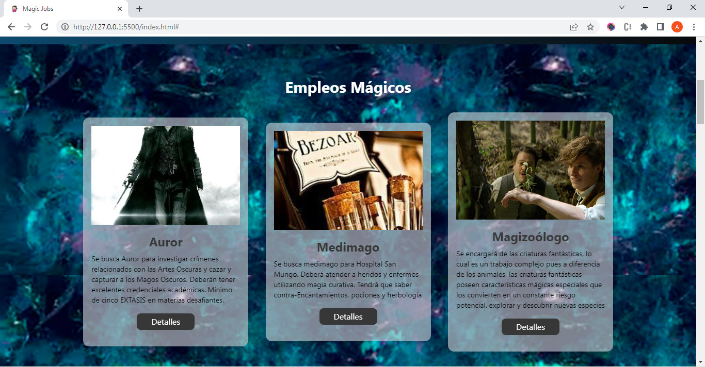
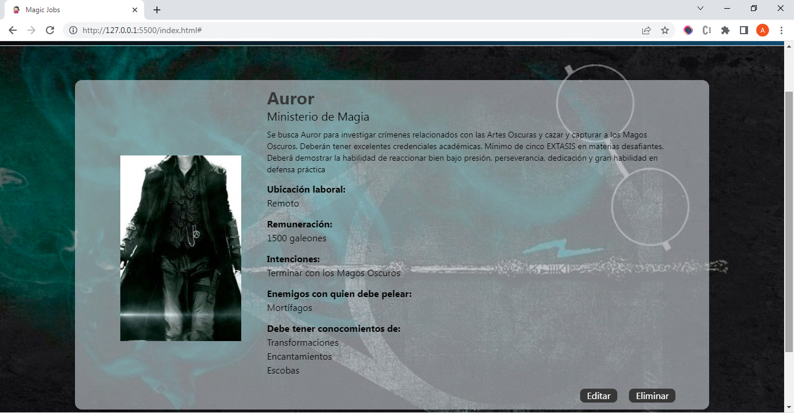
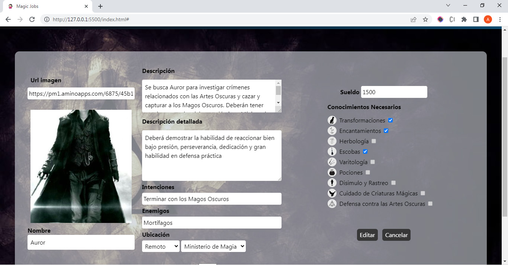
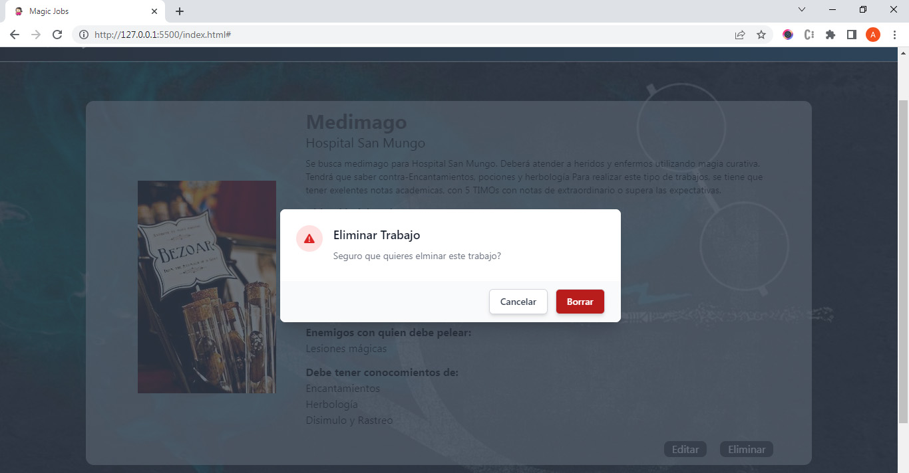

# Proyecto Magic Jobs - Proyecto JS para Carrera Desarrollo Frontend ADA

 Es un portal de empleos donde se pueden visualizar, agregar, eliminar y editar empleos. Realizada con lenguaje (JavaScript). Desarrollado el HTML con tailwind, estilos Css puros. 

 Se trabaja asincronismo con el método fetch y trabajé con la api mockapi 

 Corresponde al módulo IV de la carrera de Desarrollo Frontend ADA - por lo cual es parte de un proceso de aprendizaje 

[link del proyecto](https://ana-laura-flores.github.io/magic-jobs/)

 - Se utiliza lenguaje HTML, utilizando tailwindcss y se utiliza JavaScript para lograr las funcionalidades de todo el proyecto.

 - En el desarrollo del proyecto para su funcionamiento se utiliza JavaScript. Utilizando metodos, eventos, funciones.

 - Los datos se almacenan en la api Mockapi, mantiendo actualizada la info y los datos a cada momento. Utilizando los métodos GET, POST, PUT y DELETE.

  
  

## Es un portal de empleos.
 

Podrás agregar empleos, editarlos, eliminarlos.<em> También para una mejor búsqueda de empleos hay filtros que te ayudarán a encontrar el empleo que tanto quisiste.</em>

 

 
 

Al hacer click en agregar trabajo se abre el formulario para completar <em>Alli deberás completar toda la información solicitada.</em> Se emplea el método POST para agregar información a la api

 

 

Al ingresar a la página los trabajos cargados en la api se renderizan y se muestran.  <em> Esto es posible a traves del método GET de fetch que permite manejar datos asincrónico y traer la información de la api externa.</em>

 

 

### A medida que vas cargando los trabajos se van renderizando en la página principal.
 

Al hacer click en detalles se abrirá una página que te mostrara los detalles del trabajo.</em> Ahi tendrás la opción para poder editar o eliminar dicho trabajo

 

Para editar el empleo se te abrirá el formulario precargado con los datos que tiene la api de ese empleo<em> Podrás modificar los datos que necesites y guardar las nuevas especificaciones </em> Se utiliza el método PUT para modificar información existente en la api

 

Para eliminar un empleo podrás hacerlo del botón eliminar<em> Para evitar errores te abrirá una modal de confirmación para eliminar el empleo</em> Se utiliza el método DELETE para borrar información de la api

 

### Todos los cambios que vayas haciendo se irán modificando en la página y se cambiarán los datos en la api.

 

 

 Ana Laura Flores 

 
 (DISEÑADORA GRÁFICA UBA - ESTUDIANTE FRONTEND) 

